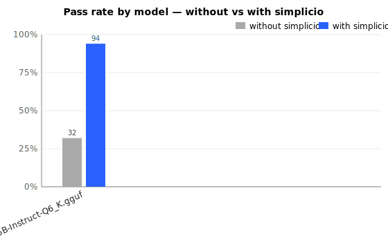
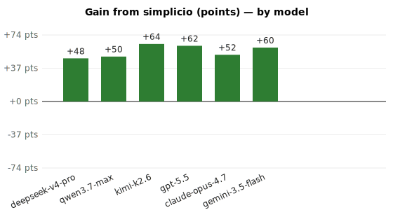
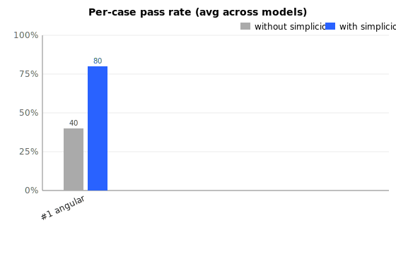
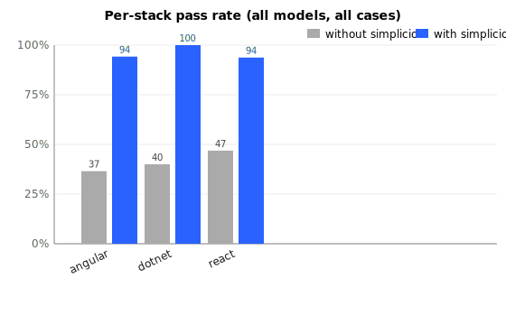

# Benchmark — simplicio-cli (offline harness)

Date: **2026-05-27**  
Models: `qwen2.5-coder:7b`  
Cases: **10** across stacks: `angular`, `dotnet`, `react`  
Base: `http://localhost:11434/v1`

Each check is a deterministic regex against the model output 
(target-file mention, DIFF block, TEST block, contract-state words). 
Same model on both sides — only the prompt structure changes. The 
*without* run is the raw one-line goal; the *with* run wraps the 
same goal in simplicio's 6-layer contract.

## Headline

- **Without simplicio:** 19/52 (36%)
- **With simplicio:** 48/52 (92%)
- **Delta:** **+56 points** (+153% relative)





## Per-model breakdown

| Model | Cases | Without | With | Delta (pts) | Relative gain |
|---|---|---|---|---|---|
| `qwen2.5-coder:7b` | 10 | 19/52 (36%) | 48/52 (92%) | **+56** | +153% |

## Per-case (averaged across models)



| # | Stack | Task | Without | With | Δ |
|---|---|---|---|---|---|
| 1 | `angular` | Hide the Delete button when the current user is not an admin | 40% | 80% | **+40** |
| 2 | `angular` | Disable the email field unless the profile role is editor. | 40% | 100% | **+60** |
| 3 | `angular` | Only show the audit log link for users with role 'auditor'. | 20% | 100% | **+80** |
| 4 | `angular` | Show 'Approve' button only when the order status is 'pending | 33% | 100% | **+67** |
| 5 | `react` | Render the export menu item only for users in the 'analytics | 20% | 80% | **+60** |
| 6 | `react` | Disable the 'Save Draft' button while the form is invalid OR | 50% | 100% | **+50** |
| 7 | `react` | Show a 'No results' empty state when the search returns zero | 20% | 100% | **+80** |
| 8 | `dotnet` | Require the 'CanApprove' policy on the Approve endpoint of t | 40% | 80% | **+40** |
| 9 | `dotnet` | Restrict the GET /reports endpoint so only users in the Mana | 60% | 80% | **+20** |
| 10 | `angular` | Show a warning banner if the user has unsaved changes and tr | 40% | 100% | **+60** |

## Per-stack



| Stack | Without | With | Δ |
|---|---|---|---|
| `angular` | 35% | 96% | **+62** |
| `dotnet` | 50% | 80% | **+30** |
| `react` | 31% | 94% | **+62** |

## Output-quality signals (rate across all runs)

Beyond pass-rate, the same outputs are scored on structural quality. 
Each row = % of runs (cases × models) where the signal is present.

| Signal | Without simplicio | With simplicio |
|---|---|---|
| DIFF block present | 0% (0/10) | 100% (10/10) |
| TEST block present | 80% (8/10) | 100% (10/10) |
| target file mentioned | 0% (0/10) | 100% (10/10) |
| avg criteria-keywords hit / run | 8.9 | 9.5 |
| avg output length (chars) | 2537 | 2310 |

## Cost — tokens & wall-clock (measured, per run)

Reported straight from the provider's `usage` field and `time.perf_counter()`. 
*Per-run* = one model call (one case, one side). With simplicio uses more input 
tokens (the 6-layer wrap) and fewer output tokens (model stops guessing earlier).

| Model | Side | Avg prompt tok | Avg completion tok | Avg total tok | Avg latency |
|---|---|---|---|---|---|
| `qwen2.5-coder:7b` | without | 46 | 567 | 613 | 58773 ms |
| `qwen2.5-coder:7b` | with    | 230 | 532 | 762 | 57243 ms |

**Aggregate over the full bench** (10 runs per side):

- without simplicio: 6,139 tokens total · 587.7s wall-clock · 613 tok/run · 58773 ms/run
- with simplicio:    7,626 tokens total · 572.4s wall-clock · 762 tok/run · 57243 ms/run
- token delta:       +1,487 (+24%)
- time delta:        -15.3s (-3%)

## How to reproduce

```bash
OPENROUTER_API_KEY=… \
  BENCH_MODELS="qwen2.5-coder:7b" \
  python3 bench/run_offline.py
```

Raw model outputs are saved under `.simplicio/bench_runs/<model>/case_NN/{sem,com}.txt` 
so you can audit what the LLM actually produced on each side. Charts are 
SVG under `bench/charts/`; raw aggregated data under `bench/results.json`.
