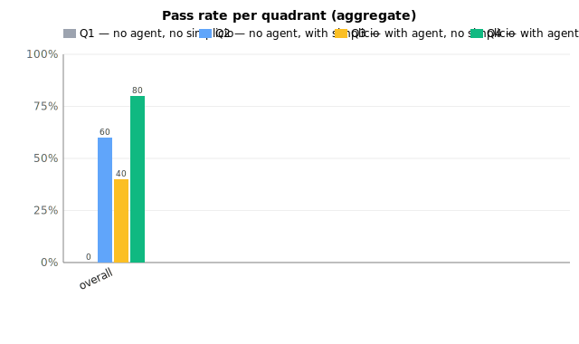
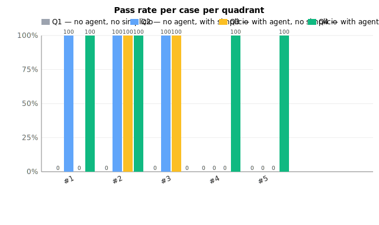
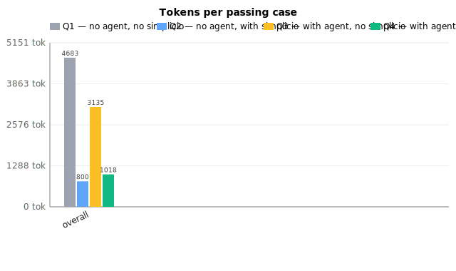

# Benchmark 4-quadrant - agent x simplicio matrix

Date: **2026-05-27**  
Models: `google/gemma-3-4b-it`, `meta-llama/llama-3.2-3b-instruct`, `qwen/qwen-2.5-7b-instruct`  
Cases: **5**, max_iters: **3**  
Base: `https://openrouter.ai/api/v1`

Methodology: [docs/benchmark-4quadrant.md](../docs/benchmark-4quadrant.md).

## Quadrants

| Cell | Prompt | Execution |
|---|---|---|
| **Q1** | raw goal | 1-shot (baseline) |
| **Q2** | simplicio 6-layer | 1-shot (current bench) |
| **Q3** | raw goal | loop with feedback (`MAX_ITERS`) |
| **Q4** | simplicio 6-layer | loop with feedback (composition) |

## Headline (aggregate over all models x cases)

| Quadrant | Pass rate | Avg iters | Tokens / pass | Wall-clock / pass |
|---|---|---|---|---|
| **Q1** (no agent, no simplicio) | 0/15 (0%) | 1.00 | 13,396 | 236,599 ms |
| **Q2** (no agent, with simplicio) | 11/15 (73%) | 1.00 | 936 | 10,045 ms |
| **Q3** (with agent, no simplicio) | 7/15 (46%) | 2.53 | 4,844 | 48,171 ms |
| **Q4** (with agent, with simplicio) | 11/15 (73%) | 1.73 | 2,319 | 14,108 ms |



## Contribution decomposition (points)

| Delta | Formula | Value |
|---|---|---|
| Prompt effect, no loop | Q2 - Q1 | **+73 pts** |
| Loop effect, no simplicio | Q3 - Q1 | **+46 pts** |
| Prompt effect inside loop | Q4 - Q3 | **+27 pts** |
| Loop effect with simplicio | Q4 - Q2 | **+0 pts** |
| Composition gain over best single axis | Q4 - max(Q2, Q3) | **+0 pts** |
| Synergy vs linear stacking | Q4 - (Q1 + (Q2-Q1) + (Q3-Q1)) | **-46 pts** |

## Hypothesis verdicts

Threshold for rejection: |delta| >= 5 points.

1. *Loop alone closes the gap (simplicio unnecessary once you loop).* Q4 - Q3 = **+27 pts**. **REJECTED**.
2. *Simplicio alone is enough (loop is overkill).* Q4 - Q2 = **+0 pts**. **NOT REJECTED**.
3. *Gains stack linearly (no synergy).* Q4 - linear = **-46 pts**. **REJECTED**.

## Cost - token & wall-clock budget

| Quadrant | Total tokens | Total wall-clock | Tokens / passing case | ms / passing case |
|---|---|---|---|---|
| Q1 | 13,396 | 236.6s | 13,396 | 236,599 |
| Q2 | 10,298 | 110.5s | 936 | 10,045 |
| Q3 | 33,913 | 337.2s | 4,844 | 48,171 |
| Q4 | 25,511 | 155.2s | 2,319 | 14,108 |

## Structural quality (rate across all runs)

| Quadrant | DIFF block | TEST block | target file mentioned |
|---|---|---|---|
| Q1 | 0% | 80% | 0% |
| Q2 | 93% | 86% | 100% |
| Q3 | 66% | 73% | 80% |
| Q4 | 93% | 93% | 100% |

## Per-model x quadrant

| Model | Q1 | Q2 | Q3 | Q4 |
|---|---|---|---|---|
| `google/gemma-3-4b-it` | 0/5 (0%) | 4/5 (80%) | 0/5 (0%) | 4/5 (80%) |
| `meta-llama/llama-3.2-3b-instruct` | 0/5 (0%) | 2/5 (40%) | 2/5 (40%) | 2/5 (40%) |
| `qwen/qwen-2.5-7b-instruct` | 0/5 (0%) | 5/5 (100%) | 5/5 (100%) | 5/5 (100%) |

## Per-case x quadrant (avg across models)

| # | Stack | Goal | Q1 | Q2 | Q3 | Q4 |
|---|---|---|---|---|---|---|
| 1 | `angular` | Hide the Delete button when the current user is no | 0/3 | 2/3 | 2/3 | 2/3 |
| 2 | `angular` | Disable the email field unless the profile role is | 0/3 | 2/3 | 2/3 | 3/3 |
| 3 | `angular` | Only show the audit log link for users with role ' | 0/3 | 2/3 | 1/3 | 2/3 |
| 4 | `angular` | Show 'Approve' button only when the order status i | 0/3 | 3/3 | 1/3 | 2/3 |
| 5 | `react` | Render the export menu item only for users in the  | 0/3 | 2/3 | 1/3 | 2/3 |





## How to reproduce

```bash
pip install -e ".[bench]"
OPENROUTER_API_KEY=...
BENCH_MODELS="google/gemma-3-4b-it,meta-llama/llama-3.2-3b-instruct,qwen/qwen-2.5-7b-instruct" \
  BENCH_MAX_ITERS=3 \
  python3 bench/run_4quadrant.py
```

Raw model outputs (one file per iteration per quadrant) live under `.simplicio/bench_4q/<model>/case_NN/q*_iter*.txt`.
