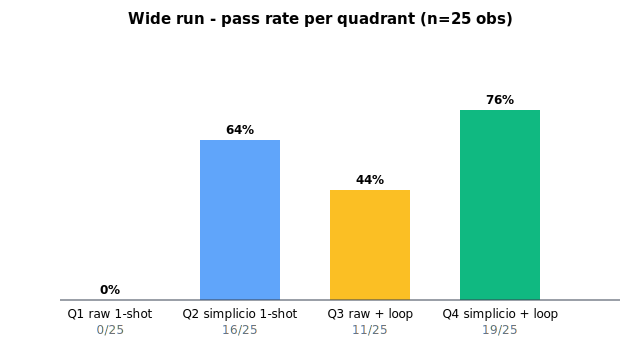
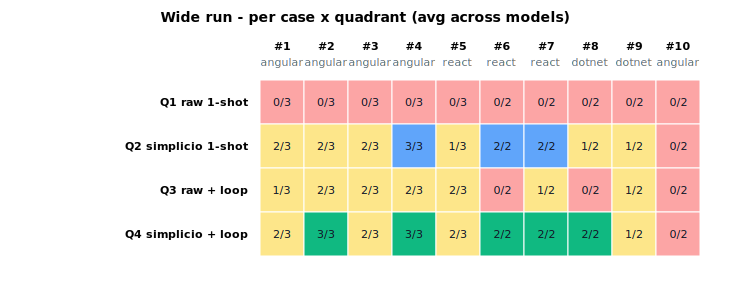
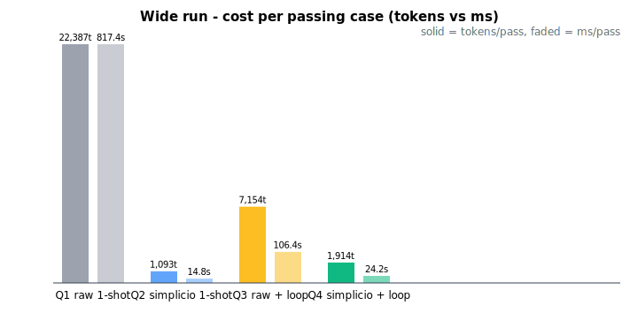

# Benchmark 4-quadrant — wider multi-model run

Date: **2026-05-26**  
Models: `google/gemma-3-4b-it`, `meta-llama/llama-3.2-3b-instruct`, `qwen/qwen-2.5-7b-instruct`  
Planned cases per model: **10**, max_iters: **5**  
Base: `https://openrouter.ai/api/v1`

> **Note**: wide run was killed mid-execution. `qwen-2.5-7b` covers only the first 5 of 10 cases. `anthropic/claude-3.5-haiku` was never reached. Aggregate below counts every observed (model, case, quadrant) tuple as one observation.

Methodology: [docs/benchmark-4quadrant.md](../docs/benchmark-4quadrant.md). Reference small run: [results_4quadrant.md](results_4quadrant.md).

## Headline — aggregate over all observed (model × case) tuples

| Quadrant | Pass rate | Avg iters | Tokens / pass | Wall-clock / pass |
|---|---|---|---|---|
| **Q1** (no agent, no simplicio) | 0/25 (0%) | 1.00 | 22,387 | 817,437 ms |
| **Q2** (no agent, with simplicio) | 16/25 (64%) | 1.00 | 1,093 | 14,797 ms |
| **Q3** (with agent, no simplicio) | 11/25 (44%) | 4.00 | 7,154 | 106,382 ms |
| **Q4** (with agent, with simplicio) | 19/25 (76%) | 2.44 | 1,914 | 24,170 ms |



PDF report: [results_4quadrant_wide.pdf](results_4quadrant_wide.pdf).

## Contribution decomposition (points)

| Delta | Formula | Value |
|---|---|---|
| Prompt effect, no loop | Q2 − Q1 | **+64 pts** |
| Loop effect, no simplicio | Q3 − Q1 | **+44 pts** |
| Prompt effect inside loop | Q4 − Q3 | **+32 pts** |
| Loop effect with simplicio | Q4 − Q2 | **+12 pts** |
| Composition gain over best single axis | Q4 − max(Q2, Q3) | **+12 pts** |
| Synergy vs linear stacking | Q4 − (Q1 + (Q2−Q1) + (Q3−Q1)) | **-32 pts** |

## Hypothesis verdicts (threshold |Δ| ≥ 5 pts)

1. *Loop alone closes the gap (simplicio unnecessary once you loop).* Q4 − Q3 = **+32 pts**. **REJECTED**.
2. *Simplicio alone is enough (loop is overkill).* Q4 − Q2 = **+12 pts**. **REJECTED**.
3. *Gains stack linearly (no synergy).* Q4 − linear = **-32 pts**. **REJECTED**.

## Per-model × quadrant

| Model | Cases | Q1 | Q2 | Q3 | Q4 |
|---|---|---|---|---|---|
| `google/gemma-3-4b-it` | 10/10 | 0/10 (0%) | 7/10 (70%) | 4/10 (40%) | 8/10 (80%) |
| `meta-llama/llama-3.2-3b-instruct` | 10/10 | 0/10 (0%) | 5/10 (50%) | 4/10 (40%) | 6/10 (60%) |
| `qwen/qwen-2.5-7b-instruct` | 5/10 | 0/5 (0%) | 4/5 (80%) | 3/5 (60%) | 5/5 (100%) |

## Cost — token & wall-clock budget

| Quadrant | Total tokens | Total wall-clock | Tokens / passing case | ms / passing case |
|---|---|---|---|---|
| Q1 | 22,387 | 817.4s | 22,387 | 817,437 |
| Q2 | 17,498 | 236.8s | 1,093 | 14,797 |
| Q3 | 78,704 | 1170.2s | 7,154 | 106,382 |
| Q4 | 36,375 | 459.2s | 1,914 | 24,170 |

## Per-case × quadrant (counts across models that ran the case)

| # | Stack | Goal | Q1 | Q2 | Q3 | Q4 |
|---|---|---|---|---|---|---|
| 1 | `angular` | Hide the Delete button when the current user is no | 0/3 | 2/3 | 1/3 | 2/3 |
| 2 | `angular` | Disable the email field unless the profile role is | 0/3 | 2/3 | 2/3 | 3/3 |
| 3 | `angular` | Only show the audit log link for users with role ' | 0/3 | 2/3 | 2/3 | 2/3 |
| 4 | `angular` | Show 'Approve' button only when the order status i | 0/3 | 3/3 | 2/3 | 3/3 |
| 5 | `react` | Render the export menu item only for users in the  | 0/3 | 1/3 | 2/3 | 2/3 |
| 6 | `react` | Disable the 'Save Draft' button while the form is  | 0/2 | 2/2 | 0/2 | 2/2 |
| 7 | `react` | Show a 'No results' empty state when the search re | 0/2 | 2/2 | 1/2 | 2/2 |
| 8 | `dotnet` | Require the 'CanApprove' policy on the Approve end | 0/2 | 1/2 | 0/2 | 2/2 |
| 9 | `dotnet` | Restrict the GET /reports endpoint so only users i | 0/2 | 1/2 | 1/2 | 1/2 |
| 10 | `angular` | Show a warning banner if the user has unsaved chan | 0/2 | 0/2 | 0/2 | 0/2 |





## How to reproduce (full wide run)

```bash
pip install -e ".[bench]"
OPENROUTER_API_KEY=...
BENCH_MODELS="google/gemma-3-4b-it,meta-llama/llama-3.2-3b-instruct,qwen/qwen-2.5-7b-instruct,anthropic/claude-3.5-haiku" \
  BENCH_MAX_ITERS=5 \
  BENCH_MAX_CASES=10 \
  python3 bench/run_4quadrant.py
```

Raw per-iteration outputs live under `.simplicio/bench_4q/<model>/case_NN/q*_iter*.txt`.
